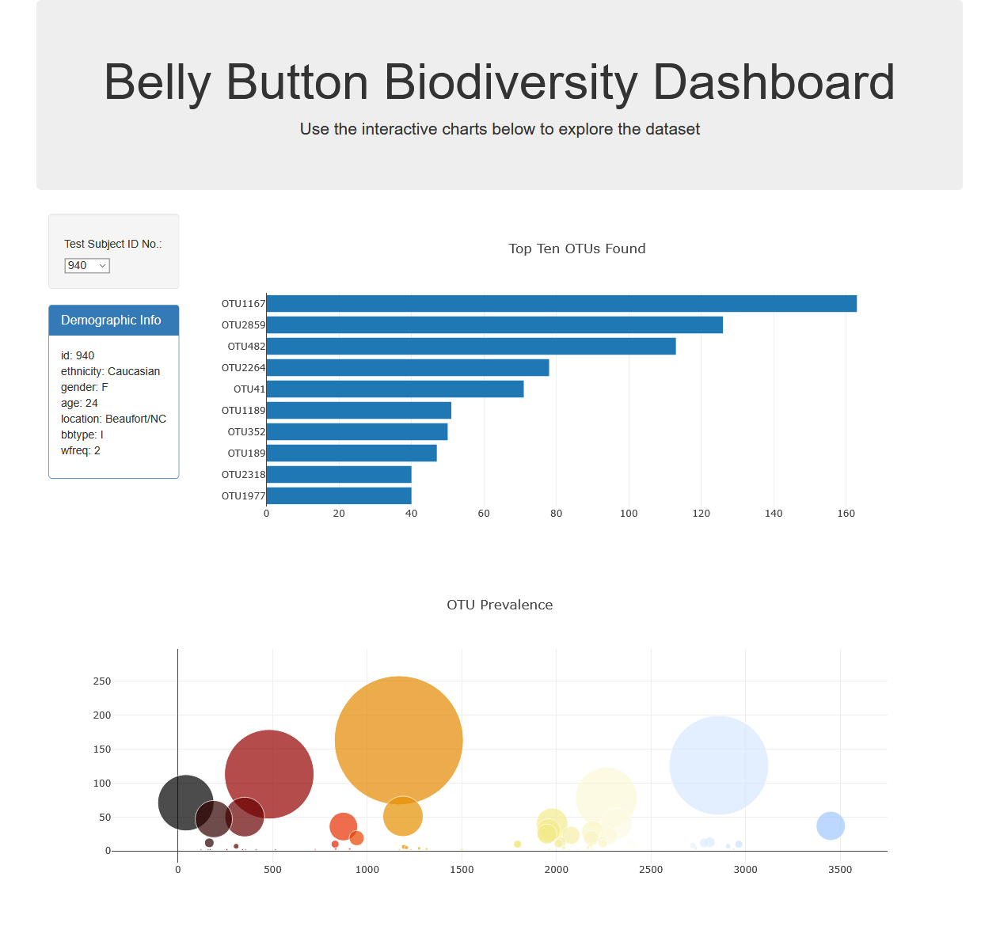
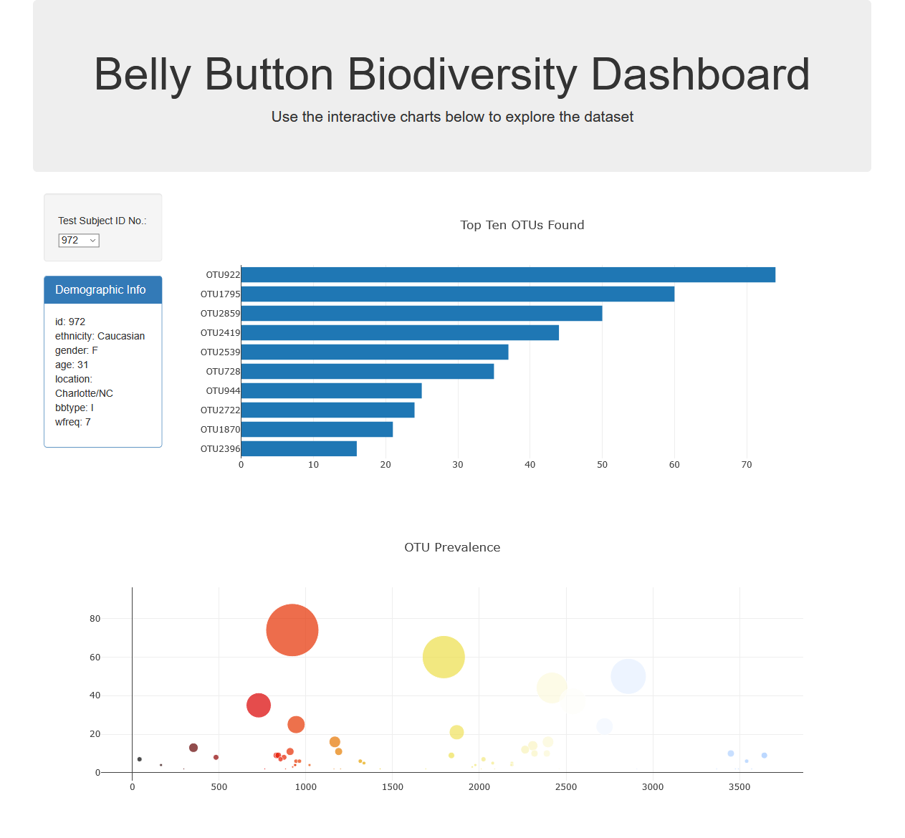
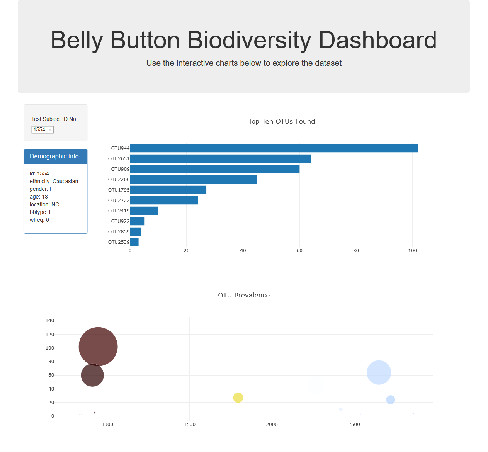

# plotly_challenge

## Belly Button Biodiversity

In this project, I was given a JSON file containing sample data from a group of test participants. 

The sample data included information on microbial species (called OTUs or Operational Taxonomic Units in the study) found in the belly buttons of the participants. 

Using JavaScript and Plotly, I created an interactive dashboard. Choose a sample, and there will be demographic information on the participant, as well as two charts showcasing the prevalence of the OTUs. 

The first chart is a bar chart of the top 10 OTUs. The second is a bubble chart of all the OTUs, but the size of the bubble shows the amount found of each. 

You can interact with the dashboard [here.](https://bpdamore.github.io/plotly_challenge/)

--------
## Dashboard Screenshots
If you'd rather just look at some pictures, here are a few screenshots displaying information on a few samples. 

-------
### Sample #940

-------
### Sample #972

-------
### Sample #1554

